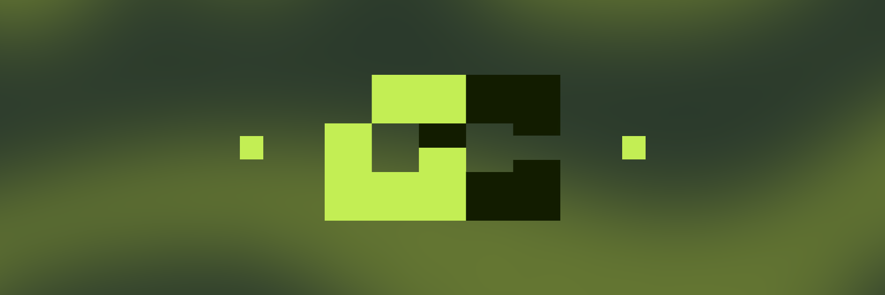
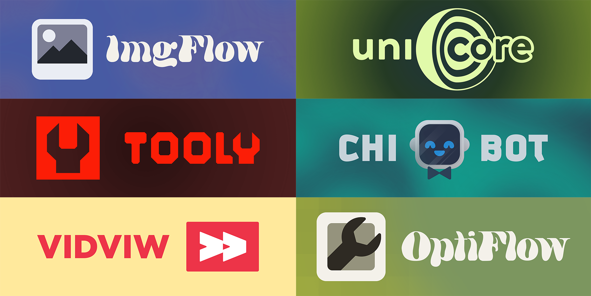

  <a href="https://www.gchibeni.com/"><b>Website</b></a>
  &nbsp;·&nbsp;
  <a href="https://www.artstation.com/gchibeni"><b>ArtStation</b></a>
  &nbsp;·&nbsp;
  <a href="https://www.instagram.com/gchibeni"><b>Instagram</b></a>
  &nbsp;·&nbsp;
  <a href="https://www.imdb.com/name/nm18639808/"><b>IMDb</b></a>
  &nbsp;·&nbsp;
  <a href="mailto:hello@gchibeni.com"><b>Email</b></a>

<h3>Hi, I'm Gabriel R. Chibeni! 👋</h3>

  <b>Game Dev</b> &nbsp;·&nbsp; <b>Tech Artist</b> &nbsp;·&nbsp; <b>Technical Director</b>
   
  Currently working as a <b>Pipeline TD</b>

  I majored in <b>Audiovisual</b> and built my foundation in 3D - modeling, texturing, rigging,
  animation, and pipeline. Games sharpened that into a focus on performance and optimization:
  I've shipped published titles across both asynchronous and real-time multiplayer, along with
  the secure server architecture and cybersecurity work that comes with them.

  These days I work on pipeline full time, but I still build games and tools I hope are useful
  beyond my own desk. I also have a hard time leaving repetitive work un-automated.

<h3>Works &amp; Tools</h3>

Everything below is open source. If a tool saves you an afternoon, it did its job.

 

  
  
  
  
  
  
  

  
  
  
  
  
  
  
  
  

  
  
  
  
  
  
  
  
  

<h3>Get in touch</h3>

  Open to freelance tech-art, game dev, tooling work, and always happy to talk pipelines.
   
  Reach me at <a href="mailto:hello@gchibeni.com"><b>my email</b></a>
  or through <a href="https://www.gchibeni.com/"><b>my website</b></a>.

<i>Based in São Paulo · Somewhere between the DCC and the engine</i>

